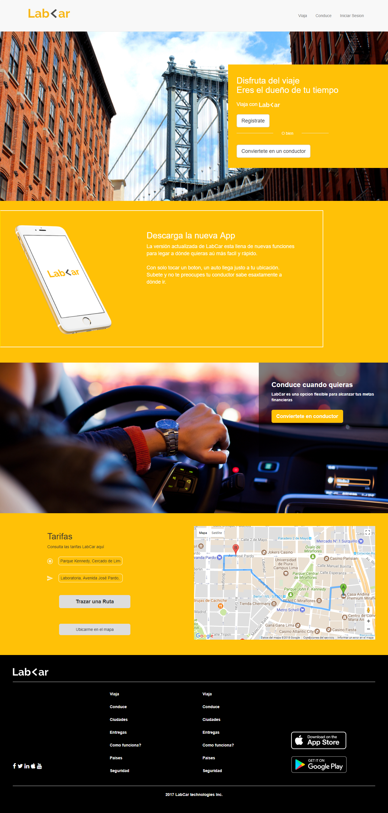
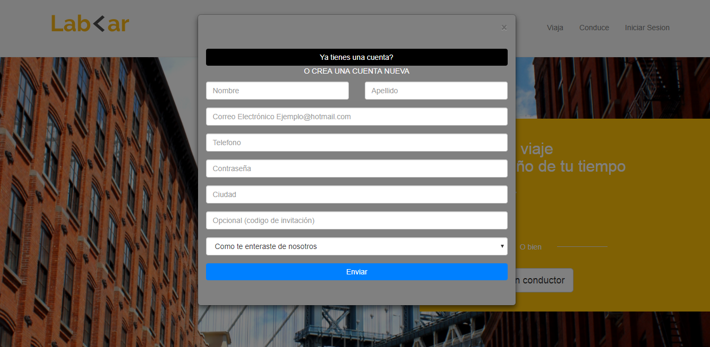
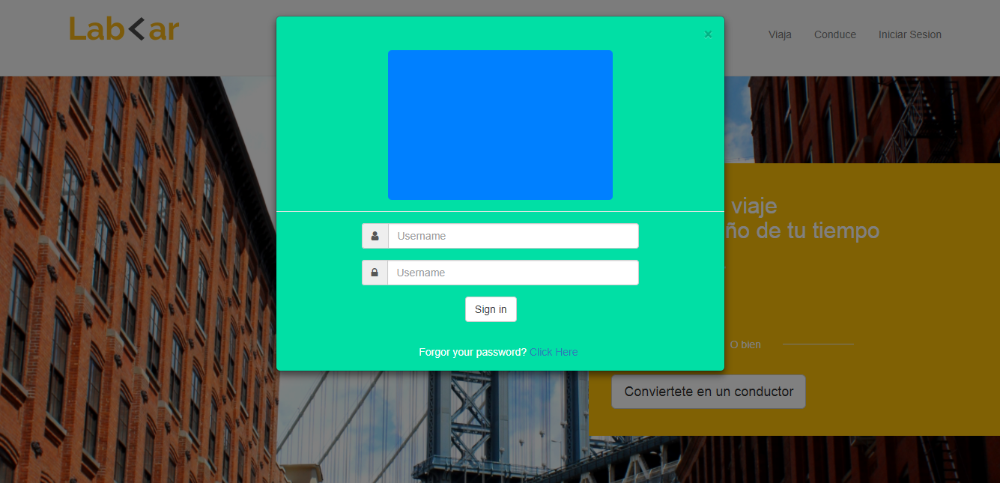
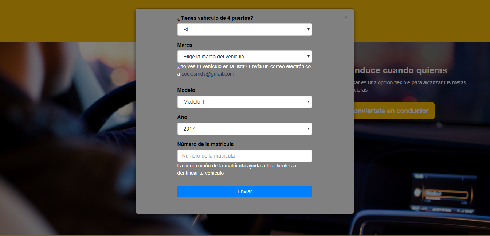
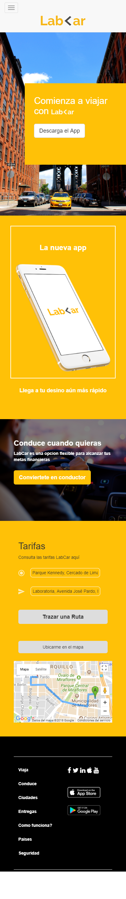

##LABCAR

1. Descripción del Proyecto:

Usando los recursos de bootstrap, la api de html5 y google maps api logramos replicar una página web responsive (mobile y desktop) para el servicio de taxis Labcar en el cual el usuario puede realizar un trazado de ruta con dos puntos ingresados por el usuario mediante inputs y visualizarlo en un mapa, además ofrece la opcion de ubicar la posicion del usuario en el mapa.

2. Herramientas utilizadas:
	- HTML5
	- CSS3
	- JS
	- Bootstrap
	- Google Maps api
	- Api de HTML5 (Geolocation)

3. Funcionamiento

  - Para el autocompletado de direcciones se uso la función de la biblioteca de Places de la Google Maps JavaScript API. Esta herramienta se uso con la finalidad de darlea la aplicación el comportamiento de escritura anticipada para simplicar el trabajo del usuario y evitar errorer de escrituras.

	- Para el trazado de ruta se uso una key única dentro de un script ubicado dentro del html en el cual se esta integrando la funcion de inicio(callback=initMap) y la libreria de autocompletado de google maps.

**VISTA DESKTOP**

**MODALES**

**MODALES**

5. Autor
	- Lilliam Haro

6. Fuentes de Consulta Rápida
 - Documentacion de Google Api [Ver](https://developers.google.com/maps/documentation/?hl=es-419)
 - Laboratoria Lms [Ver](https://lms.laboratoria.la/)
 - Documentacion de Bootstrap [Ver](https://getbootstrap.com/docs/3.3/getting-started/)
